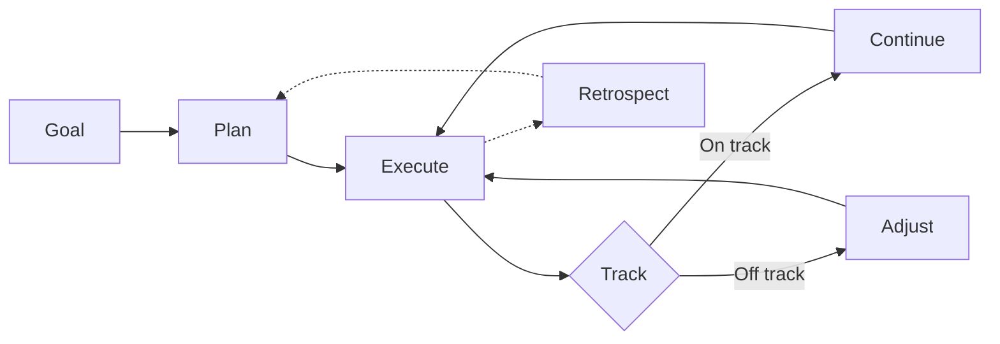

# What Is Project Management?

> The practice of planning, organizing, and managing resources to deliver a project within scope, time, and quality constraints.

> **Related:** [Agile Fundamentals](agile-fundamentals.md) | [Scrum](scrum.md) | [Kanban](kanban.md)

---

## What Is It?

Project management is **the thing you do so the work doesn't become chaos**. It's not about filling out spreadsheets — it's about answering four questions continuously:

1. **What are we building?** (scope)
2. **When will it be done?** (time)
3. **Who's doing what?** (people)
4. **How do we know we're done?** (quality)

A project manager's real job: **remove blockers, set clear expectations, and keep the team focused.**

## Why Does It Exist?

Without project management, teams experience:

- **Scope creep** — "Can we also add..." until nothing ships
- **Burnout** — No one knows when "enough" is
- **Surprises** — Stakeholders discover at launch that the wrong thing was built
- **Relearning** — Every project starts from scratch on process

Good project management makes work **predictable, sustainable, and transparent.**

## Mental Model

Think of project management as a **navigation system** for a road trip:

- The **destination** is the product goal
- The **route** is the project plan
- The **GPS** is your tracking system (burndown, velocity)
- **Detours** are scope changes — the GPS recalculates



## Methodologies at a Glance

| Methodology | Core Idea | Cadence | Ceremonies | Best For |
|-------------|-----------|---------|------------|----------|
| **Waterfall** | Plan everything upfront, then execute sequentially | One big cycle | Phase gates | Fixed-scope, low-uncertainty projects |
| **Scrum** | Fixed-length sprints with inspect-and-adapt cycles | 1-4 week sprints | Planning, standup, review, retro | Most software teams |
| **Kanban** | Continuous flow with WIP limits | None (continuous) | None required | Support, maintenance, interrupt-driven |
| **Shape Up** | Fixed scope per 6-week cycle, no sprints | 6-week cycles | Pitch, betting table, cool-down | Product teams wanting deep focus |
| **SAFe** | Scaled Scrum for large organizations | Multiple synchronized sprints | Many | 100+ person orgs (use with caution) |

> **Note:** Waterfall works when you know exactly what to build and nothing will change (e.g., regulated hardware). For software, prefer iterative approaches.

## Quality Triangle

```
    QUALITY
      /\
     /  \
    /    \
 SCOPE -- TIME
```

Change any corner, and at least one other corner changes:

- **Fix scope** → Time and quality vary
- **Fix time** → Scope and quality vary
- **Fix quality** → Scope and time vary

> **Tip:** In practice, fix time and quality, let scope flex. Ship a smaller feature set on time rather than everything late.

## Common Mistakes

| Mistake | Problem | Solution |
|---------|---------|----------|
| No process | Every project reinvents how to work | Start with Scrum, adapt |
| Process over people | Blindly following ceremonies without thinking | Inspect and adapt the process too |
| Micromanagement | Tracking hours, not outcomes | Trust the team, measure results |
| Scope lock | Refusing to change scope when reality shifts | Accept change, renegotiate tradeoffs |
| No retro | Same problems every sprint | Always retrospect, even for 15 minutes |

## Related Topics

- [Agile Fundamentals](agile-fundamentals.md) — The principles behind most modern methodologies
- [Scrum](scrum.md) — The most common agile framework

## Further Learning

- *The Mythical Man-Month* — Fred Brooks
- *Scrum: The Art of Doing Twice the Work in Half the Time* — Jeff Sutherland
- *Shape Up* — Ryan Singer (free online: basecamp.com/shapeup)

---

> **Next:** [Agile Fundamentals](agile-fundamentals.md) | **Previous:** [Project Management README](README.md)
