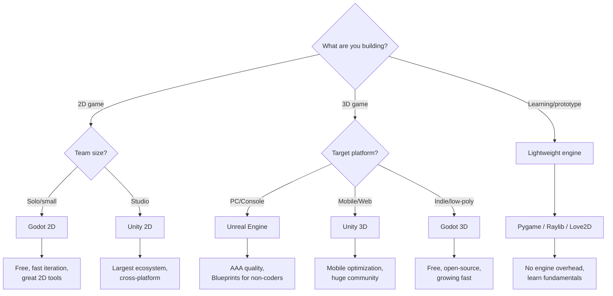

# Game Development

> How to build games — engines, game loops, physics, rendering, and the real-time programming patterns that make games work.

---

## Prerequisites

- Solid programming fundamentals (see [Languages](../06-programming-languages/README.md))
- Basic comfort with a code editor (see [Editors](../05-editors/README.md))
- Terminal basics (see [Terminal](../02-terminal/README.md))

---

## Pages in This Section

| Page | Description |
|------|-------------|
| [What Is Game Dev?](what-is-gamedev.md) | Mental model, game dev pipeline, how it differs from app dev |
| [Game Engines](game-engines.md) | Deep dive into Unity, Godot, Unreal, and raw frameworks |
| [Game Loop](game-loop.md) | The core architecture, fixed vs variable timestep, frame rate |
| [ECS](ecs.md) | Entity Component System, composition over inheritance |
| [2D Math](2d-math.md) | Vectors, matrices, transformations, collision detection |
| [Physics](physics.md) | Physics engines, rigidbodies, collision response, joints |
| [Input](input.md) | Input handling, buffering, remapping, action maps |
| [Rendering](rendering.md) | Sprites, animations, cameras, draw calls, batching |
| [Audio](audio.md) | Sound effects, music, spatial audio, mixing |
| [UI](ui.md) | Game UI, menus, HUD, canvas systems |
| [Performance](performance.md) | Profiling, optimization, object pooling, LOD |
| [Troubleshooting](gamedev-troubleshooting.md) | Common issues and fixes per engine |

---

## Decision Tree: Which Engine Should I Use?

**Rule of thumb:** Start with Godot for 2D or learning. Use Unity for cross-platform. Use Unreal for 3D quality. Use raw frameworks to learn how engines work.

---

## Quick Reference

| Concept | What It Is |
|---------|-----------|
| Game Loop | The `while(running) { input; update; render; }` cycle |
| Delta Time | Time since last frame — multiply movement by this |
| FixedUpdate | Runs at fixed intervals (physics) |
| Entity | An object in the game (player, enemy, bullet) |
| Component | Data attached to an entity (position, health) |
| System | Logic that processes components (movement, rendering) |
| Prefab/Scene | Reusable template for game objects |
| Sprite | 2D image rendered on screen |
| Collider | Shape that detects collisions |
| Rigidbody | Component that enables physics simulation |

> **Full reference:** [Game Dev Cheat Sheet](../18-cheat-sheets/gamedev-quick-reference.md)

---

> **Next:** [What Is Game Dev?](what-is-gamedev.md) | **Previous:** [AI Development](../09-ai-development/README.md)
