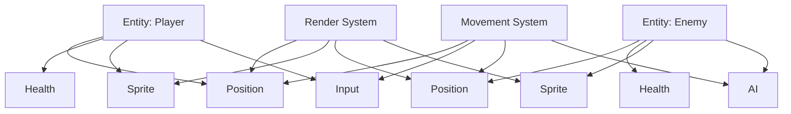

# ECS (Entity Component System)

> The architecture pattern that replaced inheritance in modern game engines — composition over inheritance, data-oriented design.

---

## What Is It?

ECS is an architectural pattern where:

- **Entities** are just IDs (not objects with behavior)
- **Components** are pure data (no logic)
- **Systems** process entities with matching components (all logic)

Instead of deep inheritance trees (`Player extends Character extends Entity`), you compose entities from small, reusable components.

> **Related:** [Game Loop](game-loop.md) for how systems run. [Game Engines](game-engines.md) for engine-specific ECS implementations.

---

## Why Does It Matter?

| Inheritance | ECS |
|-------------|-----|
| `Player extends Character` | Player = Position + Health + Input |
| Deep, brittle hierarchies | Flat, composable structure |
| Changing base class affects all | Changing a component affects few |
| Hard to reuse behavior | Mix and match components freely |
| Tightly coupled | Decoupled by design |

## Mental Model



An entity is just an ID that links components together. Systems iterate over entities that have the components they need.

## The Three Parts

### Entity

Just an identifier. No data, no behavior.

```
Entity: 1
Entity: 2
Entity: 3
```

### Component

Pure data attached to entities.

```
Position: { x: 10, y: 5 }
Health: { current: 100, max: 100 }
Sprite: { texture: "player.png", flip: false }
Velocity: { x: 0, y: 0 }
AI: { state: "patrol", target: null }
```

### System

Logic that processes entities with specific component combinations.

```
MovementSystem: Processes entities with Position + Velocity
  Updates position based on velocity * delta

RenderSystem: Processes entities with Position + Sprite
  Draws sprite at position

AISystem: Processes entities with Position + AI
  Updates AI state and sets velocity

DamageSystem: Processes entities with Health
  Applies damage, checks death
```

## Implementation Example

### Simple ECS in Python

```python
class World:
    def __init__(self):
        self.entities = {}
        self.components = {}
        self.systems = []
        self.next_id = 0

    def create_entity(self):
        entity_id = self.next_id
        self.next_id += 1
        self.entities[entity_id] = True
        return entity_id

    def add_component(self, entity_id, component_type, data):
        if component_type not in self.components:
            self.components[component_type] = {}
        self.components[component_type][entity_id] = data

    def get_component(self, entity_id, component_type):
        return self.components.get(component_type, {}).get(entity_id)

    def query(self, *component_types):
        result = []
        for entity_id in self.entities:
            has_all = all(
                entity_id in self.components.get(ct, {})
                for ct in component_types
            )
            if has_all:
                result.append(entity_id)
        return result

    def update(self, dt):
        for system in self.systems:
            system(self, dt)


# Components (just data)
class Position:
    def __init__(self, x=0, y=0):
        self.x = x
        self.y = y

class Velocity:
    def __init__(self, x=0, y=0):
        self.x = x
        self.y = y

class Health:
    def __init__(self, current=100, maximum=100):
        self.current = current
        self.maximum = maximum


# Systems (just logic)
def movement_system(world, dt):
    for entity in world.query(Position, Velocity):
        pos = world.get_component(entity, Position)
        vel = world.get_component(entity, Velocity)
        pos.x += vel.x * dt
        pos.y += vel.y * dt

def damage_system(world, dt):
    for entity in world.query(Health):
        health = world.get_component(entity, Health)
        if health.current <= 0:
            del world.entities[entity]


# Usage
world = World()
player = world.create_entity()
world.add_component(player, Position, Position(0, 0))
world.add_component(player, Velocity, Velocity(100, 0))
world.add_component(player, Health, Health(100))
```

### Unity DOTS

```csharp
public struct Position : IComponentData
{
    public float2 Value;
}

public struct Velocity : IComponentData
{
    public float2 Value;
}

public partial struct MovementSystem : ISystem
{
    [BurstCompile]
    public void OnUpdate(ref SystemState state)
    {
        float dt = SystemAPI.Time.DeltaTime;
        foreach (var (position, velocity) in
            SystemAPI.Query<RefRW<Position>, RefRO<Velocity>>())
        {
            position.ValueRW.Value += velocity.ValueRO.Value * dt;
        }
    }
}
```

### Godot (Composition Pattern)

```gdscript
# Composition pattern using child nodes

# Player scene tree:
# Player (CharacterBody2D)
#   HealthComponent (Node)
#   InputComponent (Node)
#   SpriteComponent (Node)

# HealthComponent.gd
extends Node
signal health_changed(value)
var current: int = 100

func take_damage(amount: int):
    current -= amount
    health_changed.emit(current)

# InputComponent.gd
extends Node
func get_movement() -> Vector2:
    return Vector2(
        Input.get_axis("left", "right"),
        Input.get_axis("up", "down")
    )
```

## ECS vs Traditional OOP

| Aspect | OOP (Inheritance) | ECS (Composition) |
|--------|-------------------|-------------------|
| Adding new behavior | Modify base class | Add new component |
| Reusing behavior | Copy-paste or inheritance | Attach same component |
| Data layout | Scattered across objects | Contiguous arrays (cache-friendly) |
| Testing | Test classes | Test systems independently |
| Performance | Virtual calls, cache misses | Data-oriented, batch processing |

## When to Use ECS

| Use ECS When | Use OOP When |
|--------------|--------------|
| Many entity types with shared behavior | Simple game with few entity types |
| Performance is critical | Rapid prototyping |
| Large team, clear separation | Solo dev, quick iteration |
| Data-oriented design matters | Behavior is more important than data |

## Best Practices

- **Components are data only** — No logic in components
- **Systems are stateless** — Process data, don't store it
- **Keep components small** — One responsibility per component
- **Use composition freely** — Mix and match components
- **Think in queries** — "What entities have X and Y?"

## Common Mistakes

| Mistake | Problem | Solution |
|---------|---------|----------|
| Logic in components | Violates ECS principles | Move logic to systems |
| God entities | Entity with 20 components | Split into focused entities |
| Over-engineering | ECS for Pong | Use simpler patterns for simple games |
| Not batching | Processing entities one at a time | Batch by component type |

## Related Topics

- [Game Loop](game-loop.md) — How systems run each frame
- [Game Engines](game-engines.md) — Engine-specific ECS implementations
- [Performance](performance.md) — Why ECS is fast

## Further Learning

- [ECS on Wikipedia](https://en.wikipedia.org/wiki/Entity_component_system) — Overview
- [Unity DOTS](https://docs.unity3d.com/Packages/com.unity.entities@latest) — Unity ECS
- [Bevy ECS](https://bevy-cheatbook.github.io/programming/ecs-intro.html) — Rust ECS

---

## Personal Notes

> Add your own notes, reminders, and experiences here.
