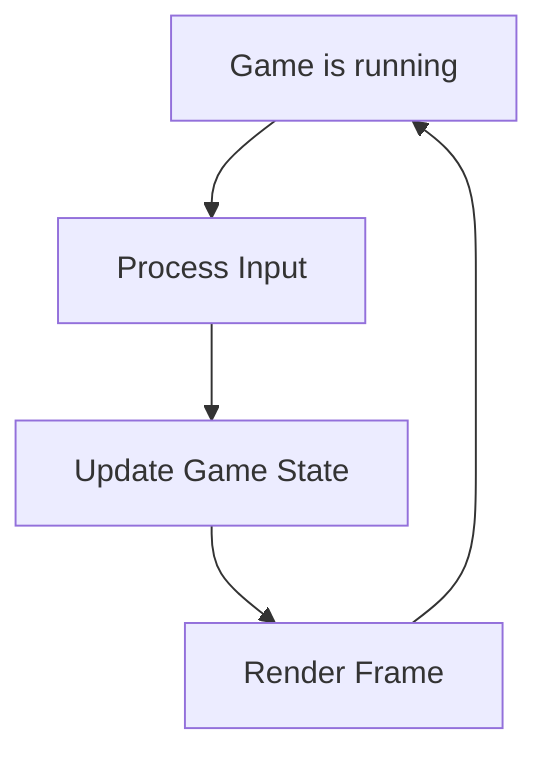

# What Is Game Development?

> Understanding how games differ from other software — the real-time loop, the architecture patterns, and the game dev pipeline.

---

## What Is It?

Game development is building software that runs in real-time, rendering frames and responding to input 30-144 times per second. Unlike web or app development where you respond to user events, games run a continuous loop that updates state and renders visuals every frame.

> **Related:** [Game Loop](game-loop.md) for the technical deep dive. [Game Engines](game-engines.md) for tool choices.

---

## Why Is It Different?

| App Development | Game Development |
|-----------------|------------------|
| Event-driven (click, tap) | Real-time loop (every frame) |
| Render when state changes | Render 60+ times per second |
| Frameworks handle timing | You control the game loop |
| State is persistent | State is simulated each frame |
| Performance is nice to have | Performance is critical |
| Users wait for responses | Users expect instant feedback |

## Mental Model



A game is a **while loop that never ends**. Each iteration:

1. **Read input** — What did the player do?
2. **Update state** — Move enemies, check collisions, apply physics
3. **Render** — Draw everything to the screen
4. **Repeat** — Until the player quits

This loop runs 30-144+ times per second. Every second of gameplay is 60+ complete cycles of input → update → render.

## The Game Development Pipeline

### Phase 1: Concept

| Activity | Output |
|----------|--------|
| Brainstorm ideas | Game concept document |
| Define core mechanic | "What makes this fun?" |
| Choose target platform | PC, mobile, console, web |
| Estimate scope | Solo jam vs multi-month project |

### Phase 2: Prototype

| Activity | Output |
|----------|--------|
| Build core mechanic | Playable greybox |
| Test if it's fun | Yes/No decision |
| Prove technical feasibility | Engine choice validated |
| Iterate on feel | Controls, timing, feedback |

### Phase 3: Production

| Activity | Output |
|----------|--------|
| Build all systems | Gameplay, UI, audio, save/load |
| Create art assets | Sprites, models, animations |
| Design levels | Progression, difficulty curve |
| Implement save system | Persistent progress |

### Phase 4: Polish

| Activity | Output |
|----------|--------|
| Juice & game feel | Particles, screen shake, sound |
| Bug fixing | Stable build |
| Performance optimization | Smooth frame rate |
| Playtesting | Balanced difficulty |

### Phase 5: Ship

| Activity | Output |
|----------|--------|
| Build for platforms | Exported builds |
| Store pages | Steam, itch.io, app stores |
| Marketing | Trailers, screenshots, social |
| Launch | Players! |

## Core Concepts

### Entities and Objects

| Term | What It Is | Example |
|------|-----------|---------|
| **Entity** | An object in the game world | Player, enemy, bullet, coin |
| **Prefab** | Reusable template for entities | Enemy prefab, bullet prefab |
| **Scene** | A collection of entities | Level 1, Main Menu, Boss Fight |
| **GameObject** | Unity's term for entity | Any object in Unity scene |
| **Node** | Godot's term for entity | Any node in Godot scene tree |

### Components and Scripts

| Term | What It Is | Example |
|------|-----------|---------|
| **Component** | Data or behavior attached to entity | Health, Sprite, Collider |
| **Script** | Custom component with logic | PlayerController, EnemyAI |
| **Transform** | Position, rotation, scale | Every entity has one |
| **MonoBehaviour** | Unity script base class | `public class Player : MonoBehaviour` |
| **Node script** | Godot script attached to node | `extends CharacterBody2D` |

### The Scene Tree

```
Scene (Level 1)
├── Player
│   ├── Sprite2D
│   ├── Collider2D
│   └── PlayerController (script)
├── Enemies
│   ├── Enemy1
│   │   ├── Sprite2D
│   │   ├── Collider2D
│   │   └── EnemyAI (script)
│   └── Enemy2
├── Tiles
│   └── TileMap
├── Camera
│   └── Camera2D
└── UI
    ├── HealthBar
    └── ScoreLabel
```

### Communication Patterns

| Pattern | How | When |
|---------|-----|------|
| Direct reference | `GetComponent<Player>()` | Known, stable relationships |
| Events/Signals | `OnHealthChanged.Invoke()` | Decoupled communication |
| Message bus | `EventBus.Publish(new Event())` | Cross-system communication |
| Shared state | ScriptableObject, global var | Read-only shared data |

## Game Dev vs Other Dev

| Skill | Web Dev | Game Dev |
|-------|---------|----------|
| Real-time rendering | No | Core skill |
| Physics simulation | Rare | Essential |
| Math (vectors, matrices) | Basic | Heavy |
| Performance optimization | Nice to have | Critical |
| Input handling | DOM events | Raw input + buffering |
| Memory management | Garbage collected | Manual or pooled |
| Audio | Background music | Spatial, layered, adaptive |

## Best Practices

- **Prototype first** — Prove it's fun before building it
- **Keep scope small** — Your first game should be tiny
- **Playtest early** — Get feedback before you're too invested
- **Build systems, not features** — Reusable > one-off
- **Use delta time** — Always multiply movement by delta time
- **Separate logic from rendering** — Game state ≠ visual representation

## Common Mistakes

| Mistake | Problem | Solution |
|---------|---------|----------|
| Skipping prototype | Build something not fun | Prove core mechanic first |
| Scope creep | Never finish | Define MVP, stick to it |
| Game logic in render | Tied to frame rate | Separate update from draw |
| Not using delta time | Speed varies with FPS | `position += velocity * delta` |
| Deep inheritance hierarchies | Brittle, hard to extend | Use composition/ECS |
| Hardcoding everything | Can't tune or iterate | Use config/ScriptableObjects |

## Related Topics

- [Game Loop](game-loop.md) — The technical architecture
- [Game Engines](game-engines.md) — Choosing your tools
- [ECS](ecs.md) — Entity Component System architecture
- [Performance](performance.md) — Optimization techniques

## Further Learning

- [Game Programming Patterns](https://gameprogrammingpatterns.com/) — Free online book
- [Red Blob Games](https://www.redblobgames.com/) — Interactive math/physics tutorials
- [Unity Learn](https://learn.unity.com/) — Official Unity tutorials
- [Godot Documentation](https://docs.godotengine.org/) — Official Godot docs

---

## Personal Notes

> Add your own notes, reminders, and experiences here.
