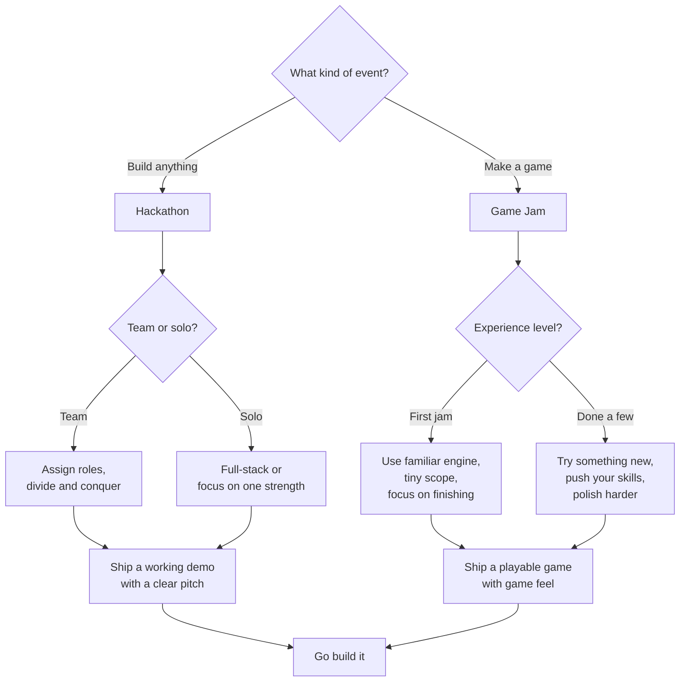

# Hackathons & Game Jams

> How to ship something you're proud of in 24-72 hours — idea selection, team coordination, time management, pitching, and everything else that makes or breaks the event.

---

## Prerequisites

- Basic programming skills in at least one language or framework
- Familiarity with version control (see [Git](../03-git/README.md))
- A code editor you're comfortable with (see [Editors](../05-editors/README.md))
- Game jams only: some experience with a game engine (see [Game Dev](../14-game-development/README.md))

---

## Pages in This Section

| Page | Description |
|------|-------------|
| [What Are Hackathons & Game Jams?](what-are-hackathons-and-game-jams.md) | Mental model, why participate, hackathon vs game jam |
| [Choosing an Idea](choosing-an-idea.md) | Brainstorming, theme analysis, feasibility filtering, MVP |
| [Team Formation & Roles](team-formation-and-roles.md) | Finding people, role assignments, solo vs team, remote |
| [Time Management](time-management.md) | Pacing, timeboxing, scope cutting, sleep strategy |
| [Tech Stack & Setup](tech-stack-and-setup.md) | Tool selection, pre-setup, boilerplates, deployment |
| [Building the MVP](building-the-mvp.md) | Core mechanic first, incremental delivery, when to pivot |
| [Polish & Juice](polish-and-juice.md) | Game feel, UI polish, audio, the last 20% |
| [The Pitch & Demo](the-pitch-and-demo.md) | Presentation structure, live demo tips, backup plans |
| [Post-Hackathon](post-hackathon.md) | Submitting, playing others' work, feedback, continuing the project |
| [Troubleshooting](troubleshooting.md) | Over-scoping, tech failure, team conflict, demo disasters |

---

## Decision Tree: What's Your Approach?

**Rule of thumb:** For your first event, cut your scope in half. Then cut it in half again. Ship something small and polished rather than something ambitious and broken.

---

## Quick Reference

| Concept | What It Is |
|---------|-----------|
| Hackathon | Time-constrained event to build a software project (usually 24-48h) |
| Game Jam | Time-constrained event to make a game (usually 48-72h) |
| Theme | The constraint or prompt that all entries must follow |
| MVP | Minimum Viable Product — the smallest thing worth showing |
| Vertical Slice | A single feature working end-to-end, from UI to database |
| Scope Cutting | Removing features to fit the time limit |
| Pitch | Short presentation to judges explaining what you built |
| Itch.io | The most common platform for publishing game jam entries |
| DevPost | The most common platform for hackathon submissions |
| Post-mortem | A retrospective written after the event about what went well and what didn't |

> **Full reference:** [Hackathons & Game Jams Cheat Sheet](../18-cheat-sheets/hackathons-quick-reference.md)

---

> **Next:** [What Are Hackathons & Game Jams?](what-are-hackathons-and-game-jams.md) | **Previous:** [Game Development](../14-game-development/README.md)
