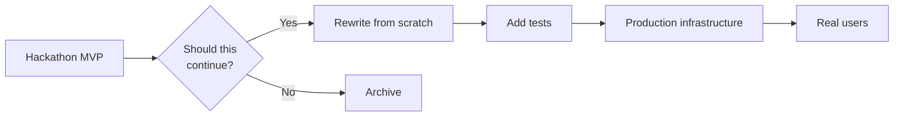

# Post-Hackathon

> What to do after the event ends — from resting and reflecting to sharing your project and deciding what's next.

> **Related:** [Troubleshooting](troubleshooting.md) | [The Pitch & Demo](the-pitch-and-demo.md)

---

## The 24 Hours After

### 1. Rest

You just ran a marathon. Your brain needs recovery time.

| Do | Don't |
|----|-------|
| Sleep. A full night. | Check results obsessively |
| Eat a proper meal | Start the next project immediately |
| Go outside | Reread your submission 20 times |
| Talk to your team about something other than code | Make any big decisions |

### 2. Celebrate

Win or lose, you **shipped something**. That puts you ahead of 90% of people who talk about building things and never do.

- Congratulate your team
- Post about it on social media
- Add it to your portfolio

## Playing Others' Work

One of the best parts of the event is seeing what everyone else built.

| Platform | How |
|----------|-----|
| **DevPost** | Browse all submissions, leave comments |
| **Itch.io** | Play other games, rate and review |
| **Discord** | Share feedback in the event channel |

### How to Give Feedback

| Good | Bad |
|------|-----|
| "The controls felt responsive. I loved the art style." | "It's too hard." |
| "I got stuck at the third level — maybe add a hint system?" | "This is broken." |
| "The core mechanic is really creative. Have you considered..." | "You should have used Unity instead." |

> **Remember:** Everyone worked hard. Be generous in your feedback. Focus on what works and constructive suggestions.

### How to Receive Feedback

- **Listen first** — don't defend or explain unless asked
- **Say thank you** — someone took time to engage with your work
- **Take notes** — patterns across multiple people are probably real problems
- **Filter later** — not all feedback is useful. You decide what to act on.

## Writing a Post-Mortem

A post-mortem is a short document reflecting on what happened. Write it within a week while it's fresh.

### Template

```markdown
# Post-Mortem: [Project Name]

## What Went Well
- [ ] Team communication — we were in sync the whole time
- [ ] Scope management — we cut features early and shipped
- [ ] Something specific: [detail]

## What Went Wrong
- [ ] Setup took too long — [detail]
- [ ] We over-engineered the [feature] — [detail]
- [ ] We didn't test the deploy — [detail]

## What I'd Do Differently
1. Pre-install everything next time
2. Pick a smaller idea
3. Spend more time on the pitch

## Key Learnings
- [One thing you'll carry to the next event]
```

### Why Write It

| Reason | Benefit |
|--------|---------|
| **Locks in learning** | You remember what worked and what didn't |
| **Portfolio value** | Shows growth and self-awareness |
| **Future events** | Refer back before your next hackathon |
| **Team alignment** | Everyone's perspective in one place |

## Continuing the Project

Most hackathon projects never get touched again. That's fine. But some deserve a second life.

| Scenario | Verdict |
|----------|---------|
| "This solves a real problem I have" | Keep going |
| "People asked to use it" | Polish and release |
| "I learned what I wanted to learn" | Archive it |
| "It was fun but not useful" | Archive it |
| "The concept has potential but execution was rushed" | Start fresh, don't rewrite the hackathon code |

### From Hackathon to Product



> **Warning:** Hackathon code is **hackathon code**. It was written in 48 hours with no sleep. If you want to continue the project, plan to **rewrite it from scratch** — not refactor. The rewrite will be faster, cleaner, and better designed than trying to untangle the hackathon spaghetti.

## Portfolio & Resume

### How to List a Hackathon

```
Hackathon Projects
├── Decision Tracker | HackMIT 2026
│   ● Built a Slack integration that logs and surfaces team decisions
│   ● Used Next.js, Supabase, and Slack API
│   ● Winner of "Best Productivity Tool" category
│   ● github.com/you/decision-tracker
```

### What to Emphasize

| Emphasize | Skip |
|-----------|------|
| What you built and why | How many hours you stayed awake |
| The problem you solved | The drama of the all-nighter |
| Technical choices and tradeoffs | The bug that almost killed your project |
| Team collaboration | That your teammate ate your snacks |

## Common Mistakes

| Mistake | Problem | Solution |
|---------|---------|----------|
| Not resting | Burnout, health issues | Take a full day off after |
| Ignoring feedback | Missed opportunity to improve | Read and reflect on others' comments |
| Keeping hackathon code in production | Security issues, tech debt | Rewrite before releasing |
| No post-mortem | Same mistakes next time | Write it within a week |
| Not sharing the project | Nobody sees your work | Post on social media, LinkedIn, your portfolio |

## Related Topics

- [Choosing an Idea](choosing-an-idea.md) — Next time, you'll choose better
- [Team Formation & Roles](team-formation-and-roles.md) — You now know who you work well with
- [Troubleshooting](troubleshooting.md) — What went wrong and how to fix it next time

## Further Learning

- [How to Write a Post-Mortem](https://www.atlassian.com/incident-management/postmortem) — Atlassian guide
- [Itch.io Game Jam Submission Guide](https://itch.io/docs/creators/game-jams)

---

> **Next:** [Troubleshooting](troubleshooting.md) | **Previous:** [The Pitch & Demo](the-pitch-and-demo.md)
