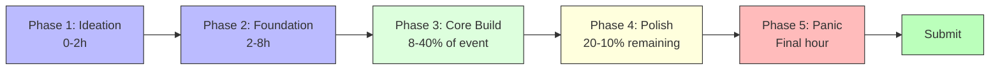
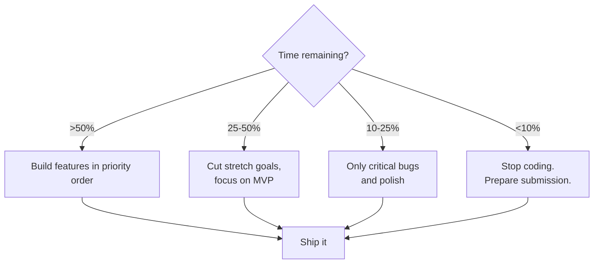

# Time Management

> The difference between shipping and failing is almost always scope management and pacing — not technical skill.

> **Related:** [Building the MVP](building-the-mvp.md) | [Choosing an Idea](choosing-an-idea.md)

---

## The Phases of a Hackathon

Every event follows a similar arc. Know the phases and plan accordingly.

### Phase 1: Ideation (First 1-2 hours)

| Do | Don't |
|----|-------|
| Brainstorm fast and filter | Get attached to your first idea |
| Agree on core feature + MVP | Debate endlessly between options |
| Assign roles | Leave roles undefined |
| Set up repo and tools | Start coding before the idea is clear |

### Phase 2: Foundation (Hours 2-8)

Get the **skeleton** working. No polish, no edge cases, just the core flow.

- [x] Project scaffold (init, build system, dependencies)
- [x] Hello world running
- [x] Database schema / data model
- [x] First API endpoint or game scene
- [x] CI/CD or deployment pipeline
- [x] Version control — first commit

### Phase 3: Core Build (8 hours to ~80% time)

The bulk of the event. Build feature by feature, **one at a time**.

| Time Remaining | Focus |
|---------------|-------|
| 75% | Build features in priority order |
| 50% | Core should be working. Cut stretch goals. |
| 40% | Stop adding features. Start bug fixing. |
| 25% | Only critical features. Cut everything else. |

### Phase 4: Polish (Last 20% of time)

Polish matters more than you think. A polished simple project beats a complex broken one.

> **Rule:** Stop adding new features when 20% of the time remains. Only polish, bug fix, and test from here.

### Phase 5: Submission (Last hour)

- Build/compile for production
- Write the description / itch.io page
- Record a demo video
- Test the final build on a clean machine
- Submit with 15 minutes to spare

## Timeboxing Strategy

| Activity | Max Time | Why |
|----------|----------|-----|
| Brainstorming | 30 min | More time = diminishing returns |
| Tech setup | 30 min | Pre-setup if possible |
| Core feature | 4-8 hours | This is where the project lives or dies |
| Bug fixing | 2 hours max | After this ship what you have |
| Polish/juice | 2-4 hours | High impact for time invested |
| Demo prep | 1 hour max | Don't over-rehearse |

### The 30-Minute Rule

> If you're stuck on something for 30 minutes, **stop** and do one of:
> 1. Ask a teammate for help
> 2. Switch to a different task
> 3. Find a simpler approach
> 4. Cut the feature entirely

## Scope Cutting Guide

Know when to cut and what to cut.

### What to Cut First

1. **Nice-to-have features** — anything not in the MVP
2. **Polished UI** — functional but ugly beats unfinished and pretty
3. **Edge cases** — handle the happy path, ignore errors for now
4. **Animation/effects** — add only if there's time
5. **Backend features** — can you fake it? (mock data, static responses)

## Sleep Strategy

| Duration | Strategy |
|----------|----------|
| **24h** | No sleep (but rest 20 min every 6 hours). Nap 45 min if you must. |
| **48h** | Sleep **at least 4 hours** the first night. Take a 90-min power nap second night. |
| **72h** | Sleep **6 hours** each night. You'll be more productive than the teams who don't. |

> **Warning:** Sleep deprivation reduces cognitive ability as much as being drunk. A well-rested team with a small project beats a sleep-deprived team with a grand vision.

## The Mid-Event Slump

Around 60-70% of the way through, every team hits a slump. Energy drops, doubt creeps in, and everything feels broken.

| Symptom | How to Push Through |
|---------|-------------------|
| "This is terrible" | It always feels terrible at this point. Keep going. |
| "We won't finish" | Cut scope. Ship something smaller. |
| "I'm exhausted" | Take a 20-minute walk. Step away from the screen. |
| "Nothing works" | Fix one small thing. Momentum builds from wins. |

> **Remember:** Every single team feels this way at some point. The teams that ship are the ones who push through.

## Common Mistakes

| Mistake | Problem | Solution |
|---------|---------|----------|
| Perfectionism | Endless polish on one feature | Set a timebox and move on |
| No breaks | Diminishing returns after 4 hours | Rest 10 min every 2 hours |
| Sleeping too little | Bad decisions, poor code quality | Sleep 4-6 hours in multi-day events |
| Golden plating | Adding features nobody asked for | Stick to the MVP definition |
| Not preparing submission | Last-minute panic | Prepare build and description 1 hour before |

## Related Topics

- [Building the MVP](building-the-mvp.md) — What to build and in what order
- [Polish & Juice](polish-and-juice.md) — Making the most of your last few hours

## Further Learning

- *Make Your Own Luck* — Ben Eater (talk about shipping under constraints)
- [GMTK: How to Finish a Game Jam](https://www.youtube.com/watch?v=7LsolhYSElw)

---

> **Next:** [Tech Stack & Setup](tech-stack-and-setup.md) | **Previous:** [Team Formation & Roles](team-formation-and-roles.md)
