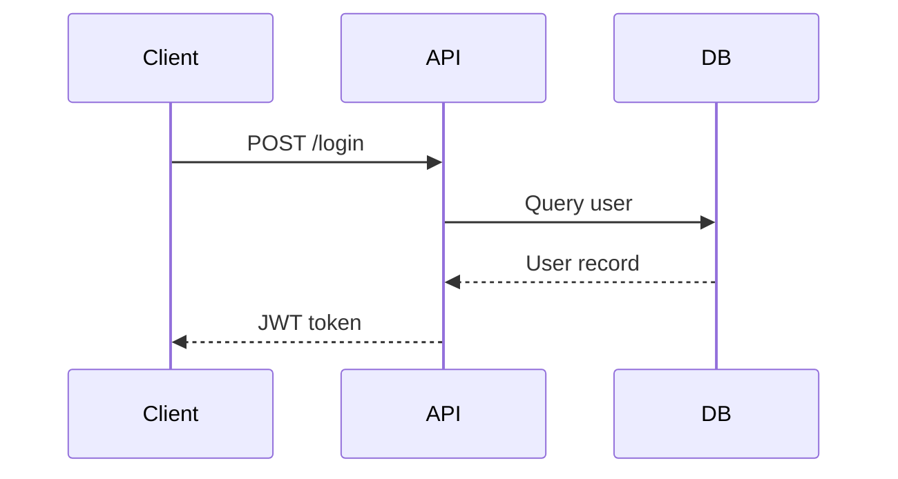
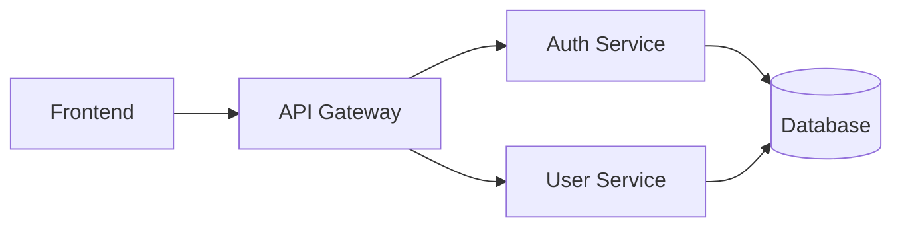
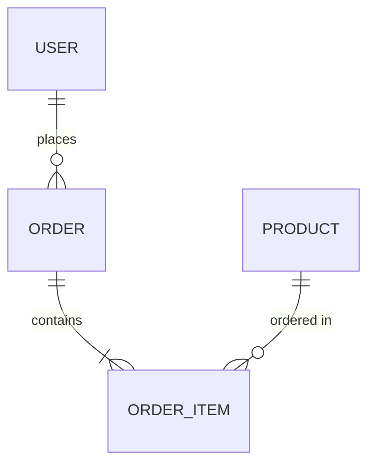

# Architecture Quick Reference

> One-page reference for design patterns, SOLID principles, ADRs, and system diagrams. Print this or bookmark it.

---

## SOLID Principles

| Principle | Meaning | Violation | Fix |
|-----------|---------|-----------|-----|
| **S**ingle Responsibility | One class = one job | Class does DB + email + logging | Split into focused classes |
| **O**pen/Closed | Open for extension, closed for modification | Modifying base class for new features | Use interfaces, inheritance, composition |
| **L**iskov Substitution | Subtypes must be substitutable | `Square extends Rectangle` breaks | Ensure behavioral compatibility |
| **I**nterface Segregation | Many small interfaces > one fat interface | `IEmployee` has 20 methods | Split into `IWorkable`, `IBillable` |
| **D**ependency Inversion | Depend on abstractions, not concretions | `new MySQLDatabase()` in class | Inject `IDatabase` interface |

## Common Design Patterns

### Creational

| Pattern | Use Case | Example |
|---------|----------|---------|
| Singleton | Single instance | DB connection pool |
| Factory | Create objects without specifying class | `Logger.create("file")` |
| Builder | Complex object construction | `new UserBuilder().name("A").build()` |
| Prototype | Clone existing objects | Copy template objects |

### Structural

| Pattern | Use Case | Example |
|---------|----------|---------|
| Adapter | Interface compatibility | Wrap old API to new interface |
| Facade | Simplify complex subsystem | `DB.query()` hides connection/pool |
| Proxy | Control access | Lazy loading, caching, auth |
| Decorator | Add behavior dynamically | `@logging` wraps function with logs |

### Behavioral

| Pattern | Use Case | Example |
|---------|----------|---------|
| Observer | Event notifications | `emitter.on("save", callback)` |
| Strategy | Swap algorithms | Different sort implementations |
| Command | Encapsulate actions | Undo/redo system |
| State | State-dependent behavior | Game entity states |

## Architecture Styles

| Style | When | Trade-offs |
|-------|------|------------|
| Monolith | Small team, early stage | Simple to start, hard to scale |
| Microservices | Large team, scale needs | Complex ops, independent deploy |
| Serverless | Event-driven, variable load | Cold start, vendor lock-in |
| CQRS | Read/write scaling needs | Complexity, eventual consistency |
| Event Sourcing | Audit trail, time travel | Storage overhead, complexity |
| Hexagonal | Testability, portability | More boilerplate, learning curve |

## Architecture Decision Records (ADR)

```markdown
# ADR-001: Use PostgreSQL

## Status
Accepted

## Context
We need a database for user data and transactions.

## Decision
We will use PostgreSQL as our primary database.

## Consequences
### Positive
- ACID compliance for transactions
- Rich data types (JSONB, arrays)
- Strong ecosystem

### Negative
- Requires more memory than SQLite
- Need to manage server
```

### ADR Template Fields

| Field | Purpose |
|-------|---------|
| Title | Short name (ADR-NNN: Decision) |
| Status | Proposed / Accepted / Deprecated / Superseded |
| Context | What situation requires a decision? |
| Decision | What was decided? |
| Consequences | What are the trade-offs? |
| Alternatives | What else was considered? |

## System Diagrams (Mermaid)

### Sequence Diagram



### Component Diagram



### Entity Relationship



## API Design

| Principle | Good | Bad |
|-----------|------|-----|
| Consistent naming | `/users`, `/users/123` | `/getUser`, `/user/list` |
| Proper status codes | `201 Created`, `404 Not Found` | `200 OK` for everything |
| Pagination | `?page=1&limit=20` | Return all records |
| Error format | `{ "error": "Not found" }` | `Not found` (plain text) |
| Versioning | `/api/v1/users` | `/api/users` (no version) |

## Common Mistakes

| Mistake | Problem | Solution |
|---------|---------|----------|
| Premature abstraction | Wrong abstractions, hard to change | Start concrete, abstract when patterns emerge |
| God class | One class does everything | Split by responsibility |
| Tight coupling | Changes ripple everywhere | Use dependency injection |
| No ADRs | Lost context for decisions | Write ADRs for significant choices |
| Over-engineering | Complexity without benefit | Follow YAGNI, solve real problems |
| Skipping docs | Knowledge loss | Maintain architecture docs |

---

> **Full section:** [Architecture](../10-software-architecture/README.md) | **Next:** [Project Management](pm-quick-reference.md)
